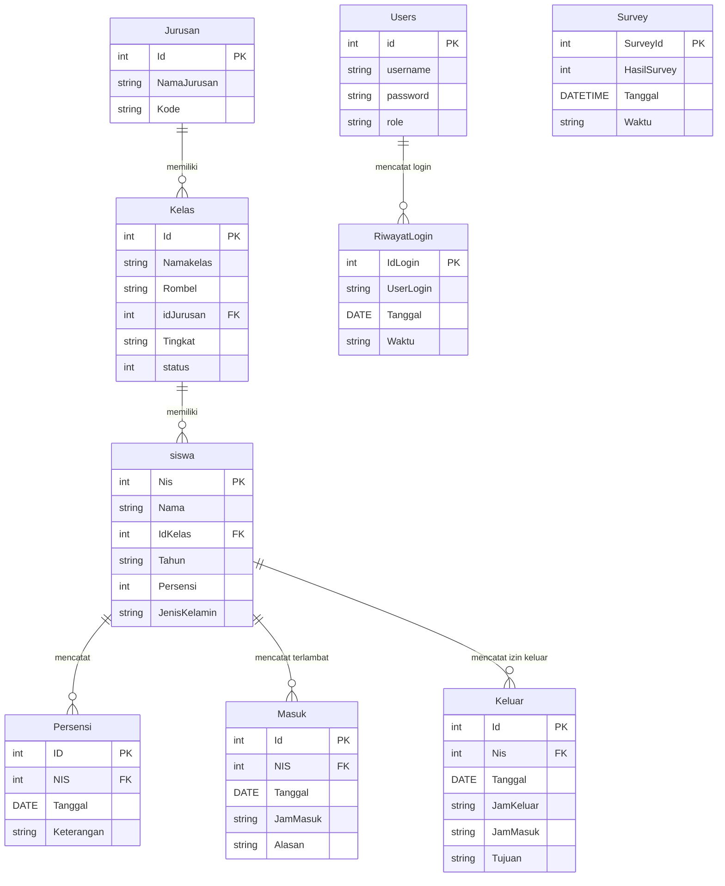

# 🏫 SIM RESI — Sistem Informasi Presensi Siswa

[](https://docs.microsoft.com/en-us/dotnet/csharp/)
[](https://dotnet.microsoft.com/)
[](https://www.sqlite.org/)
[](https://github.com/DapperLib/Dapper)
[](https://github.com/WinFormRibbon/RibbonWinForms)

**SIM RESI** (Sistem Informasi Presensi & Rekapitulasi Siswa) adalah aplikasi desktop berbasis C# WinForms yang dirancang untuk mengelola presensi siswa, pencatatan izin terlambat/keluar sekolah, rekapitulasi data kehadiran, hingga survey kepuasan secara terintegrasi, efisien, dan responsif.

---

## 🚀 Fitur-Fitur Utama

### 📋 1. Manajemen Presensi & Kehadiran Siswa
- **Pencatatan Presensi Harian:** Pilihan status Kehadiran (Hadir, Sakit, Izin, Alpha/Tanpa Keterangan).
- **Rekap Presensi Otomatis:** Perhitungan statistik rekapitulasi per periode tanggal, per kelas, maupun per individu siswa.
- **Filtering & Debounce Search:** Pencarian cepat dan penyaringan data presensi dengan pencarian berbasis *debounce timer* tanpa lag UI.
- **Paginasi Data:** Pengelompokan tampilan data dalam halaman (*pagination*) untuk performa optimal.

### 📝 2. Surat Izin Terlambat & Meninggalkan Sekolah
- **Pencatatan Siswa Terlambat (Surat Masuk):** Input NIS, alasan keterlambatan, jam masuk, dan cetak surat izin masuk kelas.
- **Pencatatan Izin Keluar (Surat Keluar):** Pencatatan siswa yang izin keluar area sekolah lengkap dengan jam keluar, jam kembali, dan tujuan.

### 🗂️ 3. Manajemen Data Master (Siswa, Kelas, Jurusan)
- **Data Siswa:** CRUD data siswa lengkap dengan NIS, Nama, Jenis Kelamin, Nomor Presensi, Kelas, dan Tahun Ajaran.
- **Import Data dari Excel:** Fitur import masal (*bulk import*) data siswa langsung dari berkas Excel (`.xlsx` / `.xls`) menggunakan EPPlus.
- **Data Kelas & Rombel:** Pengelompokan kelas berdasarkan Tingkat (X, XI, XII), Rombel, dan Jurusan.
- **Data Jurusan:** Manajemen kode dan nama jurusan (misal: RPL, AKL, TKJ, dll) dengan sinkronisasi otomatis nama kelas terhubung.

### 📊 4. Export Laporan & Rekapitulasi (Excel / Print)
- **Export Excel Rekap Presensi:** Cetak rekapitulasi presensi lengkap dengan format tabel terstruktur.
- **Export Data Terlambat & Izin Keluar:** Cetak daftar siswa terlambat dan izin keluar per rentang tanggal.
- **Export Data Survey Kepuasan:** Laporan statistik hasil survey kepuasan pengguna.

### ⭐ 5. Survey Kepuasan Pengguna
- **Form Survey Interaktif:** Modul penilaian tingkat kepuasan layanan presensi/sekolah.
- **Rekapitulasi Kepuasan:** Perhitungan persentase responden Puas vs Tidak Puas.

### 🔐 6. Keamanan & Manajemen User
- **Manajemen Pengguna (User Management):** Pengaturan akun pengguna dan hak akses admin/petugas.
- **Audit Log (Riwayat Login):** Pencatatan otomatis aktivitas login pengguna (Username, Tanggal, Waktu).

---

## 🛠️ Teknologi & Library yang Digunakan

| Komponen | Teknologi / Library | Keterangan |
| :--- | :--- | :--- |
| **Bahasa Pemrograman** | C# (.NET Framework 4.7.2) | Desktop Windows Forms Application |
| **Database Engine** | SQLite 3 (`System.Data.SQLite`) | Database terbelam ringan & portabel |
| **Micro-ORM** | Dapper 2.1.35 | Executing SQL queries super cepat |
| **User Interface** | RibbonWinForms & Guna.UI2 | Modern Windows Ribbon Menu & Controls |
| **Excel Library** | EPPlus 4.5.3.2 & ClosedXML | Reading & Writing Excel documents |
| **Kriptografi** | Argon2 & Sodium.Core | Hashing & keamanan kredensial |

---

## 🗄️ Struktur Database & Skema Tabel

Aplikasi menggunakan database SQLite (`RekapSiswaCek.db`) dengan skema terstruktur dan relasi *Foreign Key* bertingkat (`ON UPDATE CASCADE ON DELETE CASCADE`):



---

## 📁 Struktur Direktori Proyek

```text
SIM_RESI/
├── latihribbon.sln                  # File Solution Visual Studio
└── latihribbon/                     # Root Project Folder
    ├── Conn/                        # Konfigurasi Koneksi Database
    │   └── conn.cs
    ├── Dal/                         # Data Access Layer (Dapper Query Handlers)
    │   ├── AbsensiDal.cs
    │   ├── JurusanDal.cs
    │   ├── KelasDal.cs
    │   ├── KeluarDal.cs
    │   ├── MasukDal.cs
    │   ├── RekapPersensiDal.cs
    │   ├── RiwayatLogin_UserDal.cs
    │   ├── SiswaDal.cs
    │   └── SurveyDal.cs
    ├── Model/                       # Entity Models & DTOs
    │   ├── AbsensiModel.cs
    │   ├── JurusanModel.cs
    │   ├── KelasModel.cs
    │   ├── SiswaModel.cs
    │   └── ...
    ├── ScreenAdmin/                 # Form Antarmuka Administrator & Popups
    │   ├── FormAbsensi.cs
    │   ├── FormSIswa.cs
    │   ├── FormKelas.cs
    │   ├── FormJurusan.cs
    │   ├── FormRekapPersensi.cs
    │   ├── FormTerlambat.cs
    │   ├── FormKeluar.cs
    │   ├── FormUser_RiwayatLogin.cs
    │   ├── FormDataSurvey.cs
    │   ├── Cetak Data/              # Logika Export Excel & Print Laporan
    │   └── Form PopUp/              # Form Edit & Dialog PopUp
    ├── ScreenSiswa/                 # Form Layanan Surat Izin Siswa (Terlambat/Keluar)
    ├── ScreenSurvey/                # Form Interaktif Survey Kepuasan
    ├── RekapSiswaCek.db             # File Database SQLite
    ├── packages.config              # NuGet Dependencies Configuration
    └── Program.cs                   # Application Entry Point
```

---

## ⚙️ Cara Menjalankan Proyek (Setup & Run)

### Prasyarat System:
1. **Sistem Operasi:** Windows 7 / 8 / 10 / 11.
2. **IDE:** Visual Studio 2019 / 2022 (dengan beban kerja *.NET desktop development*).
3. **Runtime:** .NET Framework 4.7.2 atau versi yang lebih baru.

### Langkah-Langkah:
1. **Clone Repositori:**
   ```bash
   git clone https://github.com/beoke/Latih_Ribbon.git SIM_RESI
   cd SIM_RESI
   ```
2. **Buka Solution:**
   Buka file `latihribbon.sln` di Visual Studio.
3. **Restore NuGet Packages:**
   Di Visual Studio, klik kanan Solution `latihribbon` -> pilih **Restore NuGet Packages**.
4. **Build & Run:**
   Tekan `F5` atau klik tombol **Start** di Visual Studio untuk menjalankan aplikasi **SIM RESI**.

---

## 💡 Kualitas Kode & Pengamanan Teruji

Aplikasi **SIM RESI** telah melalui serangkaian audit kualitas dan pengamanan mendalam:
- 🛡️ **Pencegahan SQL Injection:** Seluruh pencarian dan filter query terparameterisasi menggunakan `DynamicParameters` Dapper.
- ⚡ **Asynchronous Thread Safety:** Penanganan `System.Threading.Timer` untuk pencarian debounce dilindungi pengecekan `IsHandleCreated` & `IsDisposed` untuk mencegah *Force Close* UI.
- 🛡️ **Defensive Null Checks:** Penanganan ketat pada event handler DataGridView dan parsing data (`int.TryParse` & `TimeSpan.TryParse`) untuk mencegah `NullReferenceException` maupun `FormatException`.
- 📁 **Handling Excel Kosong:** Pengecekan aman dimensi worksheet Excel untuk mencegah kesalahan saat impor data dari berkas yang tidak valid.

---

## 📝 Lisensi & Hak Cipta

Dipublikasikan di bawah lisensi terbuka untuk keperluan pengembangan dan pengelolaan presensi sekolah. 

*Dikembangkan untuk efisiensi pengelolaan data presensi siswa.*
